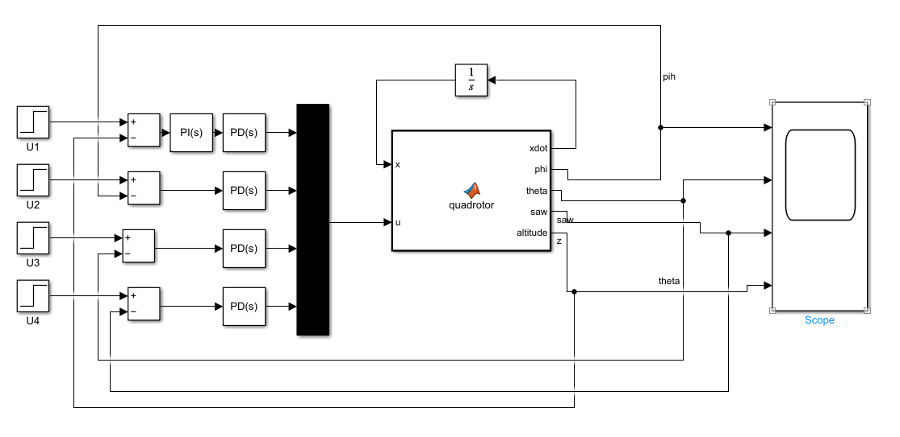
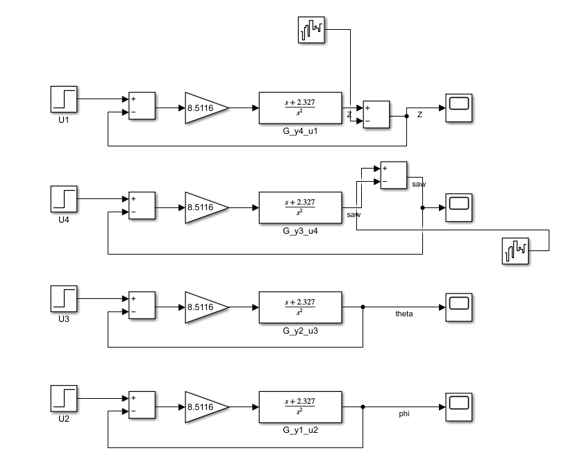
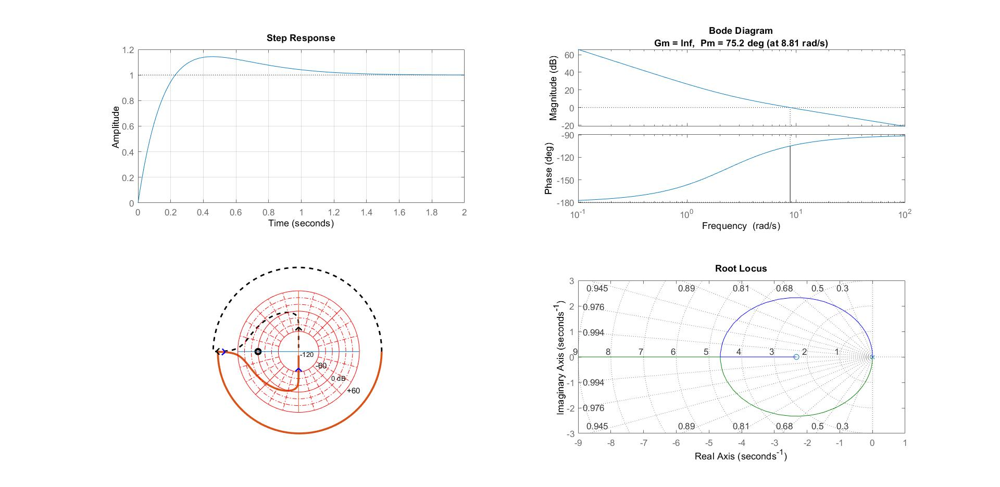

# Quadrotor Control Using Linear Control Approaches
[](https://prezi.com/view/pKVziI47jyfyDhwvlBkc/)

This project presents the modeling, analysis, and control design of a **quadrotor** using classical linear control techniques.  
The objective is to stabilize and control the drone’s altitude and attitude through PD and PI/PD controllers, designed and validated in MATLAB and Simulink.

---

## 📘 Project Overview

The goal of this project is to design and simulate a control system capable of stabilizing a quadrotor in hover mode.  
We used a **linearized state-space model** of the quadrotor and designed **PD controllers** for each control loop — roll (ϕ), pitch (θ), yaw (ψ), and altitude (z).

The entire workflow includes system modeling, control design, simulation, and performance evaluation in MATLAB and Simulink.

---

## ⚙️ Key Features

- **Linearized System Modeling:**  
  Derived a 12-state linear model around hover conditions, representing translational and rotational dynamics.

- **PD/PI Controller Design:**  
  Designed and tuned PD controllers using analytical methods (phase condition, root-locus) and MATLAB’s PID Tuner.

- **Stability and Frequency Analysis:**  
  Verified closed-loop performance using step response, Bode plots, Nyquist diagrams, and root locus analysis.

- **Simulink Implementation:**  
  Built a full control structure in Simulink, including dynamic modeling, feedback loops, and response visualization.

---

## 🧩 Modeling and Control Design

- **System Representation:**  
  The quadrotor dynamics were expressed in a **state-space form (A, B, C, D)**, capturing coupling between motion axes.

- **Control Strategy:**  
  Each motion channel was treated as a separate SISO subsystem. PD controllers were designed to achieve low overshoot and short settling time (<1s).

- **Simulation Setup:**  
  The system was implemented in Simulink with modular blocks for each controller and the dynamic model of the quadrotor.

---

## 📊 Simulation and Results

The designed controllers successfully stabilized the system in all degrees of freedom.

- Step responses showed minimal overshoot and fast settling.  
- Frequency-domain analysis confirmed sufficient gain and phase margins.  
- Simulink simulations visualized stable hover and trajectory tracking.

### 🔹 Simulink Environment


### 🔹 Quadrotor Dynamic Model


### 🔹 Control Performance Analysis
Below are the main analysis plots, including **Step Response**, **Bode Diagram**, **Nyquist Plot**, and **Root Locus**, verifying the designed PD controller’s stability and robustness:




---


## 🚀 How to Run

1. Clone the repository:
   ```bash
   git clone https://github.com/amirasadi1681/Quadrotor-Control.git
